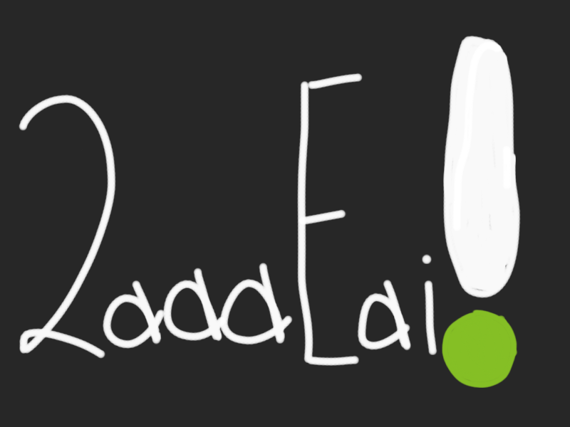

# meta-farewell-ctf

This is a modified version of a CTF challenge I created internally at Meta before I left for OpenAI in February 2024. (The original version referenced internal tools that made it unfit for public consumption.) The category is Misc/Stego (so don't go trying to DDOS anyone!) and the flag format is `fb{}` [for old times' sake](https://github.com/facebookarchive/fbctf).

**Note:** if you stumbled upon this repo by chance, start from [this Threads post](https://www.threads.net/@bolinfest/post/C31LNBjPy0V) to experience the full challenge.
